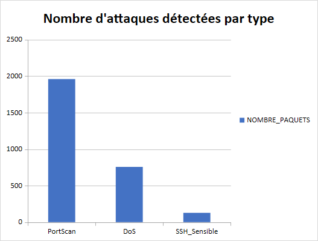
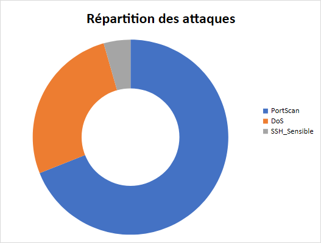

# Rapport d’analyse de trafic réseau

Ce rapport présente les activités suspectes détectées à partir du fichier tcpdump, après extraction en CSV, traitement sous Excel/VBA et génération de graphiques de synthèse.

## Résumé global

- Nombre total de paquets marqués comme suspects : **2843**.
- Paquets liés à un port scan : **1961**.
- Paquets liés à un début de déni de service (DoS) : **756**.
- Paquets liés à une activité SSH sensible : **126**.

### Diagramme des attaques par type

## Port scan

Un port scan correspond à une série de paquets TCP avec le drapeau SYN envoyés vers des ports consécutifs sur le même serveur, afin de découvrir quels ports sont ouverts.

### Visualisation du port scan

### Exemples de paquets détectés

| TIME | SOURCE | DESTINATION | PORT | FLAGS | COMMENTAIRE |
|------|--------|-------------|------|-------|-------------|
| 0.6486884374999999 | 190-0-175-100.gba.solunet.com.ar | 184.107.43.74.http | 2466 | S | Série de paquets SYN sur des ports consécutifs vers le même serveur. |
| 0.6486884374999999 | 190-0-175-100.gba.solunet.com.ar | 184.107.43.74.http | 2467 | S | Série de paquets SYN sur des ports consécutifs vers le même serveur. |
| 0.6486884374999999 | 190-0-175-100.gba.solunet.com.ar | 184.107.43.74.http | 2468 | S | Série de paquets SYN sur des ports consécutifs vers le même serveur. |
| 0.6486884374999999 | 190-0-175-100.gba.solunet.com.ar | 184.107.43.74.http | 2469 | S | Série de paquets SYN sur des ports consécutifs vers le même serveur. |
| 0.6486884374999999 | 190-0-175-100.gba.solunet.com.ar | 184.107.43.74.http | 2470 | S | Série de paquets SYN sur des ports consécutifs vers le même serveur. |
| 0.6486884374999999 | 190-0-175-100.gba.solunet.com.ar | 184.107.43.74.http | 2471 | S | Série de paquets SYN sur des ports consécutifs vers le même serveur. |
| 0.6486884374999999 | 190-0-175-100.gba.solunet.com.ar | 184.107.43.74.http | 2472 | S | Série de paquets SYN sur des ports consécutifs vers le même serveur. |
| 0.6486884374999999 | 190-0-175-100.gba.solunet.com.ar | 184.107.43.74.http | 2473 | S | Série de paquets SYN sur des ports consécutifs vers le même serveur. |
| 0.6486884374999999 | 190-0-175-100.gba.solunet.com.ar | 184.107.43.74.http | 2474 | S | Série de paquets SYN sur des ports consécutifs vers le même serveur. |
| 0.6486884374999999 | 190-0-175-100.gba.solunet.com.ar | 184.107.43.74.http | 2475 | S | Série de paquets SYN sur des ports consécutifs vers le même serveur. |

## Déni de service (DoS)

Un début de déni de service est caractérisé par un volume anormalement élevé de paquets envoyés dans un intervalle de temps très court vers la même destination.

### Graphique du volume de paquets DoS

### Exemples de paquets détectés

| TIME | SOURCE | DESTINATION | LENGTH | COMMENTAIRE |
|------|--------|-------------|--------|-------------|
| 0.6486884606481481 | 190-0-175-100.gba.solunet.com.ar | 184.107.43.74.http | 120 | Grand nombre de paquets dans la même seconde pour un même couple. |
| 0.6486885069444445 | 190-0-175-100.gba.solunet.com.ar | 184.107.43.74.http | 120 | Grand nombre de paquets dans la même seconde pour un même couple. |
| 0.6486885069444445 | 190-0-175-100.gba.solunet.com.ar | 184.107.43.74.http | 120 | Grand nombre de paquets dans la même seconde pour un même couple. |
| 0.6486885300925925 | 190-0-175-100.gba.solunet.com.ar | 184.107.43.74.http | 120 | Grand nombre de paquets dans la même seconde pour un même couple. |
| 0.6486885300925925 | 190-0-175-100.gba.solunet.com.ar | 184.107.43.74.http | 120 | Grand nombre de paquets dans la même seconde pour un même couple. |
| 0.6486885416666667 | 190-0-175-100.gba.solunet.com.ar | 184.107.43.74.http | 120 | Grand nombre de paquets dans la même seconde pour un même couple. |
| 0.6486885532407407 | 190-0-175-100.gba.solunet.com.ar | 184.107.43.74.http | 120 | Grand nombre de paquets dans la même seconde pour un même couple. |
| 0.6486885763888889 | 190-0-175-100.gba.solunet.com.ar | 184.107.43.74.http | 120 | Grand nombre de paquets dans la même seconde pour un même couple. |
| 0.6486885995370371 | 190-0-175-100.gba.solunet.com.ar | 184.107.43.74.http | 120 | Grand nombre de paquets dans la même seconde pour un même couple. |
| 0.6486886111111112 | 190-0-175-100.gba.solunet.com.ar | 184.107.43.74.http | 120 | Grand nombre de paquets dans la même seconde pour un même couple. |

## Activité SSH sensible

L’activité SSH est considérée comme sensible lorsqu’un serveur d’administration est contacté sur un port non standard, ce qui peut signaler une tentative d’accès inhabituelle.

### Exemples de paquets détectés

| TIME | SOURCE | DESTINATION | PORT | COMMENTAIRE |
|------|--------|-------------|------|-------------|
| 0.6486662847222222 | BP-Linux8.ssh | 192.168.190.130 | 50019 | Connexion SSH sur port non standard. |
| 0.6486662847222222 | BP-Linux8.ssh | 192.168.190.130 | 50019 | Connexion SSH sur port non standard. |
| 0.6486662847222222 | BP-Linux8.ssh | 192.168.190.130 | 50019 | Connexion SSH sur port non standard. |
| 0.6486662847222222 | BP-Linux8.ssh | 192.168.190.130 | 50019 | Connexion SSH sur port non standard. |
| 0.6486664930555556 | 192.168.190.130 | BP-Linux8.ssh | 50019 | Connexion SSH sur port non standard. |
| 0.6486664930555556 | 192.168.190.130 | BP-Linux8.ssh | 50019 | Connexion SSH sur port non standard. |
| 0.6486664930555556 | 192.168.190.130 | BP-Linux8.ssh | 50019 | Connexion SSH sur port non standard. |
| 0.6486664930555556 | 192.168.190.130 | BP-Linux8.ssh | 50019 | Connexion SSH sur port non standard. |
| 0.6486882986111111 | 192.168.190.130 | BP-Linux8.ssh | 50245 | Connexion SSH sur port non standard. |
| 0.6486883101851851 | BP-Linux8.ssh | 192.168.190.130 | 50245 | Connexion SSH sur port non standard. |

## Conclusion

Les comportements observés (scan de ports, pics de trafic et connexions SSH sensibles) expliquent la saturation du réseau constatée sur le site de production et justifient la mise en place de mesures de sécurité complémentaires.
